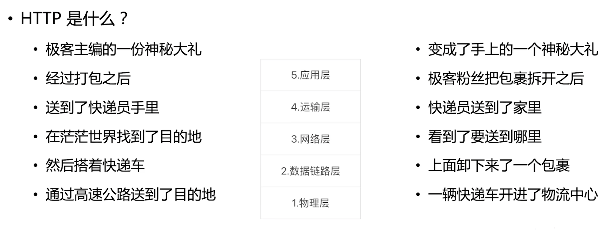

## 什么是 HTTP 服务？

HTTP 是什么？

- 应用层协议
- 五层网络协议

```text
1. 物理层 2. 数据链路层 3. 网络层 4. 运输层 5. 应用层
```



- 一个网页请求，包含两次 HTTP 包交换
  - 浏览器向 HTTP 服务器发送请求 HTTP 包
  - HTTP 服务器向浏览器返回 HTTP 包

- HTTP 服务要做什么事情？
  - 解析进来的 HTTP 请求报文
  - 返回对应的 HTTP 返回报文

## HTTP 服务

```javascript
const http = require('http');

http.createServer(function (req, res) {
  res.writeHead(200);
  res.end('hello');
}).listen(3000);
```

## HTTP 实现石头剪刀布游戏

```javascript
const http = require('http');
const url = require('url');
const fs = require('fs');
const querystring = require('querystring');

const game = require('./game');
let playerWon = 0;
let playerLastAction = null;
let sameCount = 0

http
  .createServer(function (request, response) {
    const parsedUrl = url.parse(request.url);

    if (parsedUrl.pathname == '/favicon.ico') {
      response.writeHead(200);
      response.end();
      return;
    }
    if (parsedUrl.pathname == '/game') {
      const query = querystring.parse(parsedUrl.query);
      const playerAction = query.action;

      if (playerWon >= 3 || sameCount == 9) {
        response.writeHead(500);
        response.end('再也不和你玩了!');
        return;
      }

      if (playerLastAction && playerAction == playerLastAction) {
        sameCount++
      } else {
        sameCount = 0;
      }
      playerLastAction = playerAction;

      if (sameCount >= 3) {
        response.writeHead(400);
        response.end('你作弊，不和你玩了!');
        sameCount = 9;
        return;
      }
      const gameResult = game(playerAction);


      response.writeHead(200);
      if (gameResult == 0) {
        response.end('平局!');
      } else if (gameResult == 1) {
        response.end('你赢了!');
        playerWon += 1;
      } else {
        response.end('你输了!');
      }
    }
    if (parsedUrl.pathname == '/') {
      fs.createReadStream(__dirname + '/index.html').pipe(response);
    }
  })
  .listen(3000);
```

## Express 

要了解一个框架，最好的方法是：

- 了解它的关键功能
- 推导出它要解决的问题是什么

核心功能：

- 路由
- request/response 简化
  - request：pathname、query 等
  - response：send()、json()、jsonp() 等

```javascript
const http = require('http');
const url = require('url');
const fs = require('fs');
const querystring = require('querystring');
const express = require('express');
const game = require('./game');

// 玩家胜利次数，如果超过3，则后续往该服务器的请求都返回 500
let playerWon = 0;
// 玩家的上一次游戏动作
let playerLastAction = null;
// 玩家连续出同一个动作的次数
let sameCount = 0

const app = express();

// 通过app.get设定 /favicon.ico 路径的路由
// .get 代表请求 method 是 get，所以这里可以用 post、delete 等。这个能力很适合用于创建 rest 服务
app.get('/favicon.ico', function (request, response) {
  // 一句 status(200) 代替 writeHead(200); end();
  response.status(200);
});
app.get('/', function (request, response) {
  // send接口会判断你传入的值的类型，文本的话则会处理为text/html
  // Buffer的话则会处理为下载
  response.send(fs.readFileSync(__dirname + '/index.html', 'utf-8'));
});
// 设定 /game 路径的路由
app.get('/game',
  function (request, response, next) {
    if (playerWon >= 3 || sameCount === 9) {
      response.status(500);
      response.send('再也不和你玩了!');
      return;
    }
    // 通过next执行后续中间件
    next();
    // 当后续中间件执行完之后，会执行到这个位置
    if (response.playerWon) {
      playerWon += 1;
    }
  },
  function (request, response, next) {
    // express自动帮我们把query处理好挂在request上
    const query = request.query;
    const playerAction = query.action;
    if (playerLastAction && playerAction === playerLastAction) {
      sameCount++
    } else {
      sameCount = 0;
    }
    playerLastAction = playerAction;

    if (sameCount >= 3) {
      response.status(400);
      response.send('你作弊，不和你玩了!')
      sameCount = 9;
      return;
    }
    // 把用户操作挂在response上传递给下一个中间件
    response.playerAction = playerAction;
    next();
  },
  function (request, response) {
    const playerAction = response.playerAction;
    const gameResult = game(playerAction);
    // 如果这里执行setTimeout，会导致前面的洋葱模型失效
    // 因为playerWon不是在中间件执行流程所属的那个事件循环里赋值的
    // setTimeout(()=> {
    response.status(200);
    if (gameResult === 0) {
      response.send('平局!');
    } else if (gameResult === 1) {
      response.send('你赢了!');
      response.playerWOn = true;
    } else {
      response.send('你输了!');
    }
    // }, 500)
  }
);
app.listen(3000);
```

## Koa

核心功能：

- 比 express 更极致的 request/response 简化
  - ctx.status = 200
  - ctx.body = 'hello world'
- 使用 async function 实现的中间件
  - 有“暂停执行”的能力
  - 在异步的情况下也服务洋葱模型
- 精简内核，所有额外功能都移到中间件里实现

```javascript
const fs = require('fs');
const koa = require('koa');
const mount = require('koa-mount');
const game = require('./game');

// 玩家胜利次数，如果超过3，则后续往该服务器的请求都返回 500
let playerWon = 0;
// 玩家的上一次游戏动作
let playerLastAction = null;
// 玩家连续出同一个动作的次数
let sameCount = 0

const app = new koa();

app.use(
  mount('/favicon.ico', function (ctx) {
    // koa比express做了更极致的response处理函数
    // 因为koa使用异步函数作为中间件的实现方式
    // 所以koa可以在等待所有中间件执行完毕之后再统一处理返回值，因此可以用赋值运算符
    ctx.status = 200;
  })
);

const gameKoa = new koa();
app.use(
  mount('/game', gameKoa)
);
gameKoa.use(
  async function (ctx, next) {
    if (playerWon >= 3 || sameCount === 9) {
      ctx.status = 500;
      ctx.body = '再也不和你玩了!';
      return;
    }
    // 使用await 关键字等待后续中间件执行完成
    await next();
    // 就能获得一个准确的洋葱模型效果
    if (ctx.playerWon) {
      playerWon += 1;
    }
  }
);
gameKoa.use(
  async function (ctx, next) {
    const query = ctx.query;
    const playerAction = query.action;
    if (playerLastAction && playerAction === playerLastAction) {
      sameCount++
    } else {
      sameCount = 0;
    }
    playerLastAction = playerAction;

    if (sameCount >= 3) {
      ctx.status = 400;
      ctx.body = '你作弊，不和你玩了!';
      sameCount = 9;
      return;
    }
    ctx.playerAction = playerAction;
    await next();
  }
);
gameKoa.use(
  async function (ctx, next) {
    const playerAction = ctx.playerAction;
    const gameResult = game(playerAction);

    // 对于一定需要在请求主流程里完成的操作，一定要使用await进行等待
    // 否则koa就会在当前事件循环就把http response返回出去了
    await new Promise(resolve => {
      setTimeout(() => {
        ctx.status = 200;
        if (gameResult === 0) {
          ctx.body = '平局!'
        } else if (gameResult === 1) {
          ctx.body = '你赢了!';
          ctx.playerWOn = true;
        } else {
          ctx.body = '你输了!'
        }
        resolve();
      }, 500);
    });
  }
);

app.use(
  mount('/', function (ctx) {
    ctx.body = fs.readFileSync(__dirname + '/index.html', 'utf-8');
  })
);

app.listen(3000);
```

## Express vs Koa

- Express 门槛更低，koa 更强大优雅
- express 封装更多的东西，开发更快速，koa 可定制性更高

